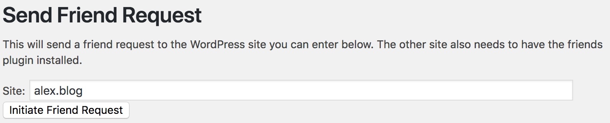
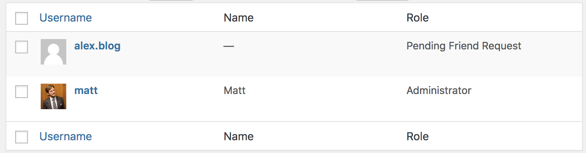
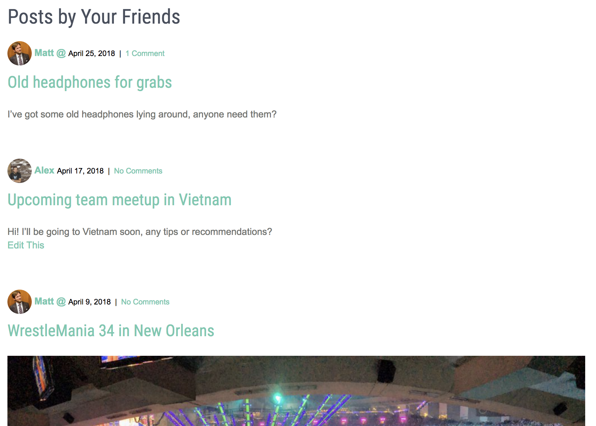
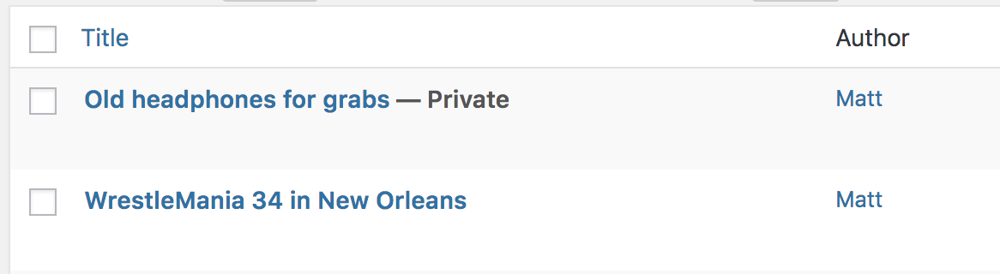

1. Initiate the friend request.

2. See the Pending Friend Request on your users page.

3. On the other site you can accept the Friend Request or delete it.

4. Friendship established!

5. On `/friends/` you can see your friends posts.

6. You'd post a new private post:

7. Not visible to random visitors.

