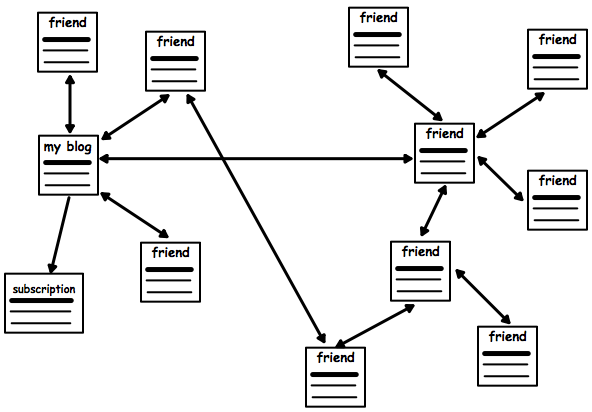

# Friends for WordPress

## Decentralized Social Networking with WordPress

Connect WordPresses and communicate privately with your friends. You can send friend requests to your friends' blogs and see their posts aggregated.

**Connect WordPresses and communicate privately with your friends**

On your WordPress site you can post anything you wish to share with the world. But blogging only becomes really interesting if you interact with other people.

With the Friends plugin, you can establish a connection with your friends' WordPress sites by making and accepting friend requests.

Let's look at an example:

You want to connect with your friend Matt and send a friend request to his WordPress. He accepts the friend request–the connection is established.

Actually you're now subscribed to his posts and he's now subscribed to your posts, so on your `/friends/` pages you'll both now see each others posts.

No big deal, this is just like subscribing to an RSS feed, right? It actually is, and that's also what's happening behind the scenes.

Things start to get more interesting if you bring private posts to the game.

When you post something with the post status sent to "Private," while not visible to the random (logged-out) visitor of your site, it is shared with your friends.

## Questions

### Why is the friendship established between WordPress sites and not WordPress users?

For one, this allows to stick with established WordPress configurations and terminologies. For example, you can use the WordPress mobile apps to post privately to your site.

Secondly, a lot of WordPresses are like cell phones. Some are used by more than one person but mostly there is a 1:1 relationship between a WordPress blog and a person.

If someone has multiple WordPresses this actually allows to segment your friendships. Close friends might want to follow all your blogs but you'd only add your photographer friends to your photoblog.

### What if the friend request is deleted or not accepted?

You'll still see the public posts from the other WordPress, you've subscribed to its public RSS feed.

### What's the point? If I want to post something privately I can use Facebook.

Well, that's actually exactly the point. Facebook owns your data, with WordPress you can decide where you want to host it and have all the benefits of running open source software.

### What happens if I modify or delete a post?

There is a cache of your friends post in form of a Custom Post Type `friend_post` that is updated when you change a post. When you delete a post your friends' WordPresses are notified and they delete the cached post.
