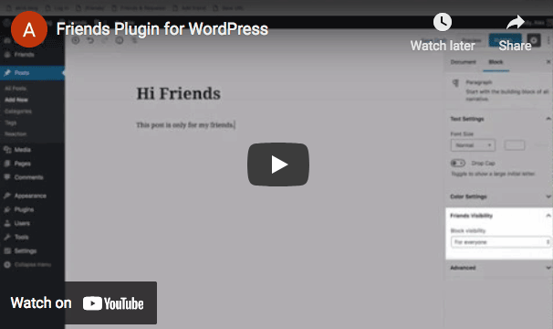

# Friends

- Contributors: akirk
- Tags: friends, rss, decentralized, social-network, own-your-data
- Requires PHP: 7.2
- Tested up to: 6.8
- License: GPL-2.0-or-later
- Stable tag: 3.6.0

Follow others via RSS and ActivityPub and read their posts on your own WordPress.

  

## Description

The Friends plugin allows you to follow content from other WordPress sites, and interact with them on your own site. You can follow friends and others via RSS. If you also have the ActivityPub plugin installed, you can follow people on Mastodon and other ActivityPub-compatible social networks.

**Since version 2.6.0, no users will be created for subscriptions.**

**Combine this plugin with the ActivityPub plugin to make your own WordPress your own Mastodon instance. Use the Enable Mastodon Apps to use mobile and desktop Mastodon apps with your own site.**

The Friends Plugin also has a "friend request" function which allows blogs to become friends with each other. This then allows private publishing on your blog while each of their friends has their own blog but will be able to see your privately published posts.

There are many small aspects that make it powerful self-hosted social reader:

You can...
- Have multiple feeds per person, so you can subscribe to their blog(s) and social media account(s).
- Categorize incoming content with Post Formats and view all posts of a certain format across your friends.
- Define rules to filter incoming content (sometimes you’re not interested in everything your friends do).
- Turn your favorite blog into your personal newsletter by receiving full-post notification e-mails
- Use feed rules to filter out content you are not interested in.
- Receive ePubs of your friends' posts to your eReader (via another plugin).
- Collect posts (from your feeds or around the web) in a collection for later reference (via another plugin).

### Philosophy

The Friends Plugin was built to make use of what WordPress provides:

- You use the WordPress infrastructure (Gutenberg or Classic Editor, what you prefer) to create your posts.
- If a post is private, only logged-in friends can see it. They can only log in through their own Friends plugin on their blog.
- Therefore, your friend is just a user on your WordPress blog, their posts are theirs, you can delete them to unfriend them.
- No extra tables: The Friends plugin just uses a post type, options and some taxonomies to store its data. When you delete the plugin, your WordPress will be slim like before.

In future, I could see mobile apps instead of talking to a third party, to talk to your own blog. It will have your friends' posts already fetched. Maybe the apps will be specialized, like Twitter or Instagram, where you'd only interact with and create posts in the specific post format.

The logo was created by Ramon Dodd, @ramonopoly. Thank you!

Documentation for the plugin can be found on the [GitHub project Wiki](https://github.com/akirk/friends/wiki).

**Development of this plugin is done [on GitHub](https://github.com/akirk/friends). Pull requests welcome. Please see [issues](https://github.com/akirk/friends/issues) reported there before going to the [plugin forum](https://wordpress.org/support/plugin/friends).**

## Installation

1. Upload the `friends` directory to the `/wp-content/plugins/` directory
1. Activate the plugin through the 'Plugins' menu in WordPress

## Frequently Asked Questions

### Does this plugin create custom tables?
No, all the functionality is achieved with standard WordPress means. Subscriptions or Friends are minimal-permission users on your install. External posts are cached in a custom post types and attributed to those users.

### Why does this create users on my WordPress install?
I believe this is a very elegant way to attribute content and it allows to delete the users content when you delete them. The users have minimal privileges, so they cannot be used to post actual content to your site.

The users can only be used for login through your specific friend's WordPress install (they are created with a strong password throw-away password), if they have been upgraded to a "friend" or "aquaintance" user.

### Why is the friendship established between WordPress sites and not WordPress users?
For one, this allows to stick with established WordPress configurations and terminologies. For example, you can use the WordPress mobile apps to post privately to your site.

Secondly, a lot of WordPresses are like cell phones. Some are used by more than one person but mostly there is a 1:1 relationship between a WordPress blog and a person.

If someone has multiple WordPresses this actually allows to segment your friendships. Close friends might want to follow all your blogs but you'd only add your photographer friends to your photoblog.

### What if the friend request is deleted or not accepted?
You'll still see the public posts from the other WordPress, you've subscribed to its public RSS feed.

### What's the point? If I want to post something privately I can use Facebook.
Well, that's actually exactly the point. Facebook owns your data, with WordPress you can decide where you want to host it and have all the benefits of running open source software.

### What happens if I modify or delete a post?
There is a cache of your friends post in form of a Custom Post Type friend_post that is updated when you change a post. When you delete a post your friends' WordPresses are notified and they delete the cached post.

## Screenshots

1. Compact view is like Google Reader
2. You can use it like a Feed Reader
3. But it is centered around users; you can have multiple feeds per person, even on social networks (parsing capabilities provided by plugins)
4. Extensible with plugins itself
5. Use the customizer to adapt it to your liking
6. Categorize incoming content with Post Formats and view all posts of a certain format across your friends
7. Use rules to filter incoming content (sometimes you’re not interested in everything your friends do)
8. Friends users are plain WordPress users with low privileges
9. A Friend Request is accepted in the users screen. Delete the user to reject it or accept the request to make them a friend

## Changelog

### 3.6.0
- Add support for PeerTube ([#546])
- Show as who you'll follow ([#545])
- Add support for following via textbox on Mastodon ([#544])
- Fix broken redirect for non-existing friends ([#539])
- Don't use iframes in autogenerated youtube embeds ([#540])
- Update function call in ActivityPub ([#543])

### 3.5.2
- Expose following list via ActivityPub ([#538])
- Convert query vars serialization to json ([#537])
- Don't replace tags outside of the friends page ([#536])
- Use EMA account data for a local user ([#535])
- EMA: Fix following number for own user ([#534])
- Remove external hover links ([#533])
- Plugin Check Fixes ([#532])
- Ajaxify Post Count display on the main friends page ([#531])
- Always apply replace rules and fix html entity replacing ([#530])

### 3.5.1
- Fix undefined user_id variable ([#525])
- Fix broken rewrite rules ([#524])

### 3.5.0
- Prevent friends page running wide in compact view ([#522])
- Prevent fatal for boosted post ([#521])
- Flush Rewrite Rules later ([#520])

### 3.4.9
- Message fixes ([#518], [#519])
- Display only images in compact mode ([#517])

### 3.4.8
- Enable Mastodon Apps: Fix wrong reblog attribution ([#510])

### 3.4.7
- Remove profile link from the Activitypub Follower e-mail ([#507])
- Add support for Youtube Feeds ([#508])
- Enable Mastodon Apps: Fix broken posting experience without ActivityPub plugin ([#506])

### 3.4.6
- EMA: Fix wrong display of blog author for friends posts in subscriptions ([#505])
- Allow CORS request for moz-extensions to the frontpage ([#501])
- Fix Fatal when accessing the Activitypub outbox ([#504])

### 3.4.5
- Enable Mastodon Apps: Fix user query ([#500])

### 3.4.4
- Friends Page: ensure friends posts can be collapsed / uncollapsed ([#496])
- Friends Page: Allow clicking on collapsed links ([#497])

### 3.4.3
- Rerelease of 3.4.2, which got stuck somewhere on WordPress.org

### 3.4.2
- Many small UI Updates ([#494]):
  - Added a keyboard shortcut for edit (press e) when you have the capabilities to edit a post (for example in a post collection)
  - Don't hide the header overflow in mobile anymore
  - Fix reply menu item to open comments on the same page
  - Add a "still loading" text when loading comments takes long
  - Show reply and boost menu links only for ActivityPub posts
  - Show the comment form even if you disabled commenting globally on your WordPress

### 3.4.1
- DMs: Preview lastest message ([#493])
- Fix broken DMs when using the blog user in Activitypub ([#492])

### 3.4.0
- Fix old posts not being deleted for ActivityPub ([#476])
- Implement DMs for ActivityPub and EMA ([#489])
- Improve Frontend margins ([#490])
- Replace string ids for subscriptions with high ints ([#483])
- Fix redirect after converting user ([#484])
- Fix replying to posts with a different permalink ([#478])
- EMA: Implement following endpoint data ([#480])
- EMA: Remove old filters ([#482])
- Extension: Allow moz-extension as a URL protocol ([#477])

### 3.3.5
- Use Outbox of the upcoming ActivityPub 5.3.0 and fix announce+like bug with Activitypub 5.2.0 ([#463])
- Fix editing widgets in a block theme ([#475])
- Augment bookmarks and favourites endpoints in EMA ([#474])
- Improve the display of boosted posts ([#473])

### 3.3.4
- Reduce the size of the Follow link ([#472])
- Fix unfollowing in Enable Mastodon Apps ([#471])
- Bring back the collapse button for statuses ([#470])
- Update plugins.json by @liviacarolgouvea ([#468])
- Don't rewrite data URLs ([#467])
- Prepare for the next Enable Mastodon Update ([#466])
- Don't add domain for mentions ([#465])
- Boosting: Show when there is a problem retrieving a URL ([#464])
- Fix wrong link in User Notifications ([#462])
- Don't double fetch URL for boosting ([#461])
- Prevent 404s for static templates ([#452])
- ActivityPub parser: avoid PHP warning by @jeherve ([#459])
- Dashboard: make widget title translatable by @jeherve ([#457])
- At A Glance messaging: ensure numbers are correctly displayed by @jeherve ([#458])
- Prevent error when no summary is set ([#453])
- Fix reversed Diff for post updates in the log ([#450])

### 3.3.3
- Remove the setting to change the post formats in the main query loop because it was confusing ([#446])
- Protect posts that I have reacted on ([#447])
- Fix Typo which prevented unannounces ([#443])
- Plugins: Fix the More Details link ([#445])
- Check the right user option about the follower e-mail ([#444])

### 3.3.2
- Fixed sending ActivityPub boosts ([#440])
- Fixed deleting by global retention number ([#439])

### 3.3.1
- Fix some styling issues ([#437])
- Fix FediPress installation ([#435])

### 3.3.0
- Styling Overhaul! ([#431])
- Add the FediPress theme ([#433])
- Incoming Feed Items: Fix in-article hash links ([#426])
- Add more functions for a browser extension ([#427])
- Browser Extension: API Key per user ([#429])
- Fix parsing Pixelfed's Image attachments ([#430])
- Add the friend's avatar to the page header ([#422])
- Add inline follow link ([#432])
- Log the newly supported ActivityPub events to the Friends Log ([#423])
- Augment the ActivityPub New Follower E-Mail ([#434])

### 3.2.3
- ActivityPub: Support update of posts and people ([#421])
- Add support for ActivityPub Move activity ([#420])
- Make tagged Friend Posts accessible ([#419])
- Uninstall: Delete more taxonomy entries ([#415])
- Standardize REST Error messages ([#413])
- Use the ActivityPub blog user as an actor if set to blog profile only ([#411])
- Add a Duplicate Remover ([#409])

### 3.2.2
- Move permissions checks into a dedicated permission_callback ([#408])
- Add more checks around friendships ([#407])

Hoping that this hardening will bring back the plugin to the WordPress.org directory after [this issue](https://www.wordfence.com/threat-intel/vulnerabilities/wordpress-plugins/friends/friends-321-missing-authorization) was reported. While I am unsure it qualified to get the plugin taken down, I've done some hardening and bugfixing in the above pull requests. Unfortunately it was not reported in a way that it could be patched in time. If you have a security issue to report, please follow the instructions on [https://github.com/akirk/friends/blob/main/SECURITY.md](https://github.com/akirk/friends/blob/main/SECURITY.md) and/or report through [https://github.com/akirk/friends/security](https://github.com/akirk/friends/security).

### 3.2.1
- OPML Import: Support OPMLs without nesting ([#403])

### 3.2.0
- Improve Translate Live compatibility ([#401])
- Fix blog follower count in sidebar ([#400])

### 3.1.9
- Fix bug with loading the main theme ([#398])

### 3.1.8
- Fix missing JavaScript on the frontend ([#396])

### 3.1.7
- Add a theme selector ([#393])
- Followers: Add Support for ActivityPub plugins blog profile ([#394])
- Generate the suggested user login from the display name ([#395])

### 3.1.6
- Site Health: Check if the cron job is enabled ([#391])
- Fix starring of a friend ([#392])
- Layout improvements props @liviagouvea in ([#384])

### 3.1.5
- Fix next page articles attached in the wrong place ([#388])
- Allow an extra redirect when discovering feeds ([#389])

### 3.1.4
- Fix Warning:  Undefined variable $account ([#385])
- Fixes for Friend Messages ([#387])
- Add Podcast Support ([#386])

### 3.1.3
- Add AJAX refreshing of feeds ([#382])
- Fix Fatal in the MF2 library ([#381])

### 3.1.2
- Fix support for threads.net ([#378])
- Add a warning if a user has not enabled ActivityPub on their threads.net account ([#377])
- Upgrade and improve the MF2 library ([#374])

### 3.1.1
- Improve Name Detection ([#372])
- Add a Button to the Welcome page ([#373])

### 3.1.0
- Add mark tag CSS to emails to ensure highlighting ([#365])
- Only show the dashboard widgets if the user has enough permissions ([#368])
- Prevent retrieving the same feed in parallel ([#366])
- Add Friend: Use more info from the given URL ([#369])
- Log ActivityPub actions and add the publish date to Announcements ([#364])
- Improve OPML Support ([#370])
- Update blueprints for previewing in WordPress Playground ([#371])

### 3.0.0
- Show Mutual Followers and allow removing of followers ([#359])
- Add an e-mail notification for new and lost followers ([#358])
- Add the ability to disable notifications per post format and feed parser ([#357])
- Fix 404 on the New private post widget props @liviacarolgouvea ([#361])
- Improve ghost.org ActivityPub compatibility ([#356])

[#356]: https://github.com/akirk/friends/pull/356
[#357]: https://github.com/akirk/friends/pull/357
[#358]: https://github.com/akirk/friends/pull/358
[#359]: https://github.com/akirk/friends/pull/359
[#361]: https://github.com/akirk/friends/pull/361
[#364]: https://github.com/akirk/friends/pull/364
[#365]: https://github.com/akirk/friends/pull/365
[#366]: https://github.com/akirk/friends/pull/366
[#368]: https://github.com/akirk/friends/pull/368
[#369]: https://github.com/akirk/friends/pull/369
[#370]: https://github.com/akirk/friends/pull/370
[#371]: https://github.com/akirk/friends/pull/371
[#372]: https://github.com/akirk/friends/pull/372
[#373]: https://github.com/akirk/friends/pull/373
[#374]: https://github.com/akirk/friends/pull/374
[#377]: https://github.com/akirk/friends/pull/377
[#378]: https://github.com/akirk/friends/pull/378
[#381]: https://github.com/akirk/friends/pull/381
[#382]: https://github.com/akirk/friends/pull/382
[#384]: https://github.com/akirk/friends/pull/384
[#385]: https://github.com/akirk/friends/pull/385
[#386]: https://github.com/akirk/friends/pull/386
[#387]: https://github.com/akirk/friends/pull/387
[#388]: https://github.com/akirk/friends/pull/388
[#389]: https://github.com/akirk/friends/pull/389
[#391]: https://github.com/akirk/friends/pull/391
[#392]: https://github.com/akirk/friends/pull/392
[#393]: https://github.com/akirk/friends/pull/393
[#394]: https://github.com/akirk/friends/pull/394
[#395]: https://github.com/akirk/friends/pull/395
[#396]: https://github.com/akirk/friends/pull/396
[#398]: https://github.com/akirk/friends/pull/398
[#400]: https://github.com/akirk/friends/pull/400
[#401]: https://github.com/akirk/friends/pull/401
[#403]: https://github.com/akirk/friends/pull/403
[#407]: https://github.com/akirk/friends/pull/407
[#408]: https://github.com/akirk/friends/pull/408
[#409]: https://github.com/akirk/friends/pull/409
[#411]: https://github.com/akirk/friends/pull/411
[#413]: https://github.com/akirk/friends/pull/413
[#415]: https://github.com/akirk/friends/pull/415
[#419]: https://github.com/akirk/friends/pull/419
[#420]: https://github.com/akirk/friends/pull/420
[#421]: https://github.com/akirk/friends/pull/421
[#422]: https://github.com/akirk/friends/pull/422
[#423]: https://github.com/akirk/friends/pull/423
[#426]: https://github.com/akirk/friends/pull/426
[#427]: https://github.com/akirk/friends/pull/427
[#429]: https://github.com/akirk/friends/pull/429
[#430]: https://github.com/akirk/friends/pull/430
[#431]: https://github.com/akirk/friends/pull/431
[#432]: https://github.com/akirk/friends/pull/432
[#433]: https://github.com/akirk/friends/pull/433
[#434]: https://github.com/akirk/friends/pull/434
[#435]: https://github.com/akirk/friends/pull/435
[#437]: https://github.com/akirk/friends/pull/437
[#439]: https://github.com/akirk/friends/pull/439
[#440]: https://github.com/akirk/friends/pull/440
[#443]: https://github.com/akirk/friends/pull/443
[#444]: https://github.com/akirk/friends/pull/444
[#445]: https://github.com/akirk/friends/pull/445
[#446]: https://github.com/akirk/friends/pull/446
[#447]: https://github.com/akirk/friends/pull/447
[#450]: https://github.com/akirk/friends/pull/450
[#452]: https://github.com/akirk/friends/pull/452
[#453]: https://github.com/akirk/friends/pull/453
[#457]: https://github.com/akirk/friends/pull/457
[#458]: https://github.com/akirk/friends/pull/458
[#459]: https://github.com/akirk/friends/pull/459
[#461]: https://github.com/akirk/friends/pull/461
[#462]: https://github.com/akirk/friends/pull/462
[#463]: https://github.com/akirk/friends/pull/463
[#464]: https://github.com/akirk/friends/pull/464
[#465]: https://github.com/akirk/friends/pull/465
[#466]: https://github.com/akirk/friends/pull/466
[#467]: https://github.com/akirk/friends/pull/467
[#468]: https://github.com/akirk/friends/pull/468
[#470]: https://github.com/akirk/friends/pull/470
[#471]: https://github.com/akirk/friends/pull/471
[#472]: https://github.com/akirk/friends/pull/472
[#473]: https://github.com/akirk/friends/pull/473
[#474]: https://github.com/akirk/friends/pull/474
[#475]: https://github.com/akirk/friends/pull/475
[#476]: https://github.com/akirk/friends/pull/476
[#477]: https://github.com/akirk/friends/pull/477
[#478]: https://github.com/akirk/friends/pull/478
[#480]: https://github.com/akirk/friends/pull/480
[#482]: https://github.com/akirk/friends/pull/482
[#483]: https://github.com/akirk/friends/pull/483
[#484]: https://github.com/akirk/friends/pull/484
[#489]: https://github.com/akirk/friends/pull/489
[#490]: https://github.com/akirk/friends/pull/490
[#492]: https://github.com/akirk/friends/pull/492
[#493]: https://github.com/akirk/friends/pull/493
[#494]: https://github.com/akirk/friends/pull/494
[#496]: https://github.com/akirk/friends/pull/496
[#497]: https://github.com/akirk/friends/pull/497

[#500]: https://github.com/akirk/friends/pull/500

[#501]: https://github.com/akirk/friends/pull/501
[#504]: https://github.com/akirk/friends/pull/504
[#505]: https://github.com/akirk/friends/pull/505

[#506]: https://github.com/akirk/friends/pull/506
[#507]: https://github.com/akirk/friends/pull/507
[#508]: https://github.com/akirk/friends/pull/508

[#510]: https://github.com/akirk/friends/pull/510

[#517]: https://github.com/akirk/friends/pull/517
[#518]: https://github.com/akirk/friends/pull/518
[#519]: https://github.com/akirk/friends/pull/519

[#520]: https://github.com/akirk/friends/pull/520
[#521]: https://github.com/akirk/friends/pull/521
[#522]: https://github.com/akirk/friends/pull/522

[#524]: https://github.com/akirk/friends/pull/524
[#525]: https://github.com/akirk/friends/pull/525

[#530]: https://github.com/akirk/friends/pull/530
[#531]: https://github.com/akirk/friends/pull/531
[#532]: https://github.com/akirk/friends/pull/532
[#533]: https://github.com/akirk/friends/pull/533
[#534]: https://github.com/akirk/friends/pull/534
[#535]: https://github.com/akirk/friends/pull/535
[#536]: https://github.com/akirk/friends/pull/536
[#537]: https://github.com/akirk/friends/pull/537
[#538]: https://github.com/akirk/friends/pull/538

[#539]: https://github.com/akirk/friends/pull/539
[#540]: https://github.com/akirk/friends/pull/540
[#543]: https://github.com/akirk/friends/pull/543
[#544]: https://github.com/akirk/friends/pull/544
[#545]: https://github.com/akirk/friends/pull/545
[#546]: https://github.com/akirk/friends/pull/546
